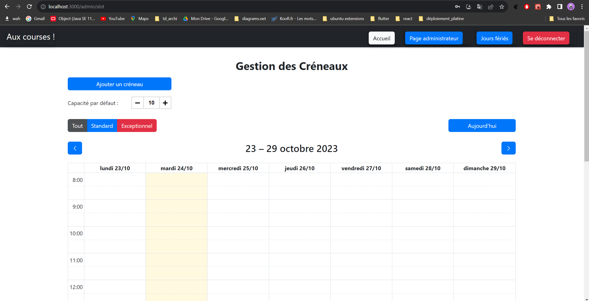

# Projet SRA - 2023 - 2024 - Groupes Créneaux

<!-- TOC -->
- [Projet SRA - 2023 - 2024 - Groupes Créneaux](#projet-sra---2023---2024---groupes-creneaux)
  - [L'équipe projet](#l-equipe-projet)
  - [Description du projet](#description-du-projet)
  - [Récupération du projet](#récupération-du-projet)
  - [Exécution du projet](#exécution-du-projet)
  - [Utilisation de l'application](#utilisation-de-lapplication)
    - [Tests](#tests)
    - [Documentation API](#documentation-api)
    - [Accéder a la Base de donnée](#accéder-à-la-base-de-donnée)
    - [Javadoc du backend](#javadoc-du-backend)
    - [Architecture du projet](#architecture-du-projet)
    - [Diagramme de classes](#diagramme-de-classes)
    - [Actions supplémentaires réalisées sur le projet](#actions-supplémentaires-réalisées-sur-le-projet)
    - [Difficultés rencontrées](#difficultés-rencontrées)
    - [Apports du projet](#apports-du-projet)
    - [Améliorations possibles](#améliorations-possibles)
    - [Dépendances du projet](#dependances-du-projet)
      - [Back-end](#back-end)
      - [Front-end](#front-end)
<!-- /TOC -->

### L equipe projet

| Nom        | Prénom    | Email                                |
|------------|-----------|--------------------------------------|
| ATCHEDJI   | Churchill | churchill.atchedji.etu@univ-lille.fr |
| DELBERGHE  | Arnaud    | arnaud.delberghe.etu@univ-lille.fr   |
| EL KHAYARI | Zakaria   | zakaria.elkhayari.etu@univ-lille.fr  |
| KESRAOUI   | Nassima   | nassima.kesraoui.etu@univ-lille.fr   |

## Description du projet

Le projet implique la gestion de créneaux de retrait de commandes pour les clients d'un service de drive.

En tant qu'administrateur, vous pouvez créer, modifier et afficher des créneaux standards, définis par jour de la
semaine, heure de début, heure de fin et capacité de commande. Vous pouvez également gérer les jours fériés et les
créneaux d'ouverture exceptionnelle.

Les clients, lors de la validation de leur panier, choisissent un créneau disponible parmi les 6
prochains jours pour planifier leur retrait. Le système assure que le créneau choisi respecte les contraintes, comme la
capacité disponible et le délai de début d'au moins 1 heure. Une confirmation de commande est ensuite générée et
associée au créneau dans la base de données.

## Récupération du projet

Récupérer le projet depuis le dépôt gitlab soit par ssh soit par https.

Par ssh :

```shell
    git clone git@gitlab-ssh.univ-lille.fr:SRA1-2023/Classroom-SRA1-2023/projects/eservices-f-creneaux.git
```

Par https :

```shell
    git clone https://gitlab.univ-lille.fr/SRA1-2023/Classroom-SRA1-2023/projects/eservices-f-creneaux.git
```

## Exécution du projet

Nous disposons d'une application spring boot pour le back-end et d'une application React pour le front-end.

Pour démarrer le projet, il faut lancer les deux applications.

Deux méthodes existent pour lancer le projet.

### Lancer le projet avec docker-compose

#### Prérequis

    - Docker
    - Docker-compose

#### Commande

Pour démarrer le projet, il suffit de démarrer le service docker et de lancer la commande suivante à la racine du :

```shell
    docker-compose up
```


Pour arrêter le projet, il suffit de lancer la commande suivante à la racine du projet :

```shell
    docker-compose down
```

### Lancer le projet avec maven et npm

#### Prérequis

    - Maven
    - NodeJS 16 ou supérieur
    - Java 17 ou supérieur

#### Commandes

**Pour** lancer le back-end, il faut se rendre dans le dossier **back** et lancer les commandes suivantes :

```shell
    mvn clean install
```

```shell
    mvn spring-boot:run
```

La commande **mvn clean install** permet de compiler le projet et de générer le fichier jar de l'application.
La commande **mvn spring-boot:run** permet de lancer l'application back-end.

**Pour** lancer le front-end, il faut se rendre dans le dossier **front** et lancer les commandes suivantes :

```shell
    npm install
```

```shell
    npm run start
```

La commande **npm install** permet d'installer les dépendances du projet et la commande **npm run start** permet de
lancer l'application front-end.

## Utilisation de l'application

Une fois l'application lancée, vous pouvez accéder à l'application front-end à l'adresse suivante depuis votre
navigateur : [(http://localhost:3000)](http://localhost:3000)


Au lancement, vous aurez par défaut deux utilisateurs créés.

| Type           | Email            | Mot de passe |
|----------------|------------------|--------------|
| Administrateur | admin@gmail.com  | admin        |
| Client         | client@gmail.com | client       |

Comme requis pour le projet, il existe des actions qui ne sont accessibles qu'aux administrateurs.

Ainsi, en tant que client, une fois connecté, j'accède à mon panier et je peux choisir un créneau de retrait
de ma commande parmi les créneaux disponibles.


En tant qu'administrateur, je peux gérer les créneaux, les jours fériés et les créneaux exceptionnels.



Les différentes actions sont accessibles depuis le menu de navigation.
Pour plus de détails sur les fonctionnalités, vous pouvez consulter la description des users
stories [ici](./docs/CRENEAUX.md).

### Tests

Le back-end dispose de tests unitaires et d'intégration.
Ils sont lancés automatiquement lors de la compilation du projet.
Vous pouvez néanmoins les lancer manuellement avec la commande suivante :

```shell
    mvn test
```

### Documentation API

La documentation OPEN (API Swagger) du back-end est disponible à l'adresse
suivante : [http://localhost:8080/tools/swagger-ui/index.html#/](http://localhost:8080/tools/swagger-ui/index.html#/)

### Accéder à la Base de donnée

La base de donnée H2 utilisée est accessible à la route : [http://localhost:8080/tools/h2](http://localhost:8080/tools/h2).

Vous pourrez alors réaliser plusieurs requêtes SQL directement via une interface dédiée.


### Javadoc du backend

Pour générer la javadoc du back-end, il faut lancer la commande suivante depuis le dossier **back** :

```shell
    mvn javadoc:javadoc
```

Une fois la commande exécutée, la javadoc est accessible localement depuis le fichier **target/site/apidocs/index.html**
qui se trouve dans le dossier **back**.

### Architecture du projet

Pour notre projet, nous avons décidé d'implémenter l'architecture back-end suivante :


On peut donc reconnaître le design Pattern "Template" pour nos entités Client et Admin. Ainsi que pour nos StandardSlots
et nos ExceptionalSlots. Ce design Pattern nous permet de factoriser le code de nos entités et de les rendre plus
maintenables et plus évolutives.

Nous avons décidé d'implémenter Spring Security en associant notre User à l'interface UserDetails que fournit Spring
Security. Ce qui nous permet de nous connecter en tant qu'Admin ou en tant que Client selon les logins fournis et le
type de notre User.

La connexion se fait grâce à un token JWT partagé à l'utilisateur dès qu'il est authentifié. Ce JWT va contenir
plusieurs informations liées à l'utilisateur comme son email, son rôle et son nom d'utilisateur.

Ce token est valide pendant 1h.

### Diagramme de classes

Des diagrammes de classes plus précis pour chaque entité ont été générés dans le dossier [**docs/diagrams
**](./docs/diagrams).

### Actions supplémentaires réalisées sur le projet

Nous avons mis en place une pipeline CI avec Gitlab CI. Cette pipeline permet de lancer les tests unitaires sur le
back-end
et de builder les projets sur le front-end et le back-end afin de s'assurer que le code est fonctionnel et qu'il n'y a
pas d'erreurs.

Nous avons également mis en place un serveur SonarQube pour analyser la qualité du code de notre projet. Ce serveur
est accessible à l'adresse suivante : [http://localhost:9000](http://localhost:9000) une fois le projet lancé.

Vous devez toutefois générer un token sonarqube pour pouvoir lancer l'analyse du code.
Ensuite lancer la commande suivante depuis le dossier **back** :

```shell
   mvn clean verify sonar:sonar -Dsonar.projectKey=PROJECT_KEY -Dsonar.projectName='SRA-CRENEAUX' -Dsonar.host.url=http://localhost:9000 -Dsonar.token=SONAR_TOKEN
```

où _PROJECT_KEY_ est la clé du projet sonarqube et _SONAR_TOKEN_ est le token généré.

Cette analyse permet de détecter les bugs, les vulnérabilités, les codes smells et les duplications de code.
Aussi, elle affiche grâce au plugin Jacoco, la couverture de code de notre projet.

### Choix particuliers

Nous avons décidé d'utiliser Spring Security pour gérer notre authentification. Cela nous a permis de mettre en place un
système d'authentification fiable et d'intégrer une protection sur nos routes selon le rôle de notre utilisateur.

Le front a été réalisé avec ReactJS pour facilité pour le développement.

La base de donnée est une base de donnée H2. Elle est générée au lancement de notre application avec deux utilisateurs
créés par défaut. Cela nous a permis de gérer notre bdd chacun de notre côté et de l'héberger en mémoire.

Pour une meilleure gestion des utilisateurs et des slots, nous avons utilisé le design Pattern appelé "Template
Method".

Afin d'améliorer l'expérience utilisateur, nous avons créé un faux panier pré-rempli pour l'utilisateur côté front.
L'utilisateur a alors vraiment l'impression de réserver un créneau pour récupérer son panier. Mais le panier n'est pas
mémorisé.

### Difficultés rencontrées

- Implémentations de Spring Security.
- Problèmes de CorsOrigin, dû aux difficultés d'implémentations de Spring Security.
- Problèmes pour s'organiser, les User Story étaient difficiles à découper pour bien se répartir les tâches. Chaque User
  Story dépendait
  d'une autre User story et du fait de ces dépendances, nous avons rencontré des problèmes de conflits de code avec Git
- La compréhension du sujet. Certains termes ambigus nous ont parfois bloqués ou amenés dà revenir en arrière
  sur certaines de nos implémentations, car nous les avions mal interprétés.

### Apports du projet

Le projet nous a permis de mettre en pratique les notions vues en cours et de mieux nous familiariser avec les
technologies utilisées telles que Spring Boot, Spring Security, ReactJS, Docker, SonarQube, etc.

En utilisant le pair programming, nous avons amélioré considérablement la qualité de notre code en détectant et
corrigeant les erreurs plus rapidement, tout en favorisant un transfert de connaissances continu entre les membres de
l'équipe.

Cette collaboration accrue a également renforcé la communication et la cohésion au sein du groupe, ce qui a eu
un impact positif sur notre gestion de projet.

Nous avons réussi tant bien que mal à nous organiser pour travailler en parallèle sur les différentes User Stories,
et à profiter des points forts de chaque membre de l'équipe.

De plus, notre utilisation de Git a rendu la gestion du code source plus fluide, améliorant ainsi la traçabilité des
modifications.

En fin de compte, ce projet nous a également servi de référence précieuse pour éviter de refaire les
mêmes erreurs dans nos projets futurs, grâce à l'accumulation de connaissances, d'expérience et de bonnes pratiques.

### Améliorations possibles

Pour les améliorations possibles que nous avons identifiées, nous avons pensé à :

- Ajouter un serveur Nginx pour gérer les communications entre notre backend et notre frontend. Cela nous permettrait
  de gérer les CORS plus facilement et de sécuriser notre application.
- Effectuer régulièrement des points sur l'avancement du projet pour éviter les conflits de code et les problèmes de
  dépendances entre les User Stories.
- Travailler avec du TDD (Test Driven Development) pour faciliter le développement et s'assurer d'avancer dans la bonne
  direction en respectant les User Stories.
- Effectuer des tests de performances sur notre application pour vérifier qu'elle est bien optimisée.

### Dépendances du projet

Voici ci-dessous la liste des principales dépendances utilisées pour le projet.

#### Back-end

| Dépendance                              | Description                                                                                                                                                  |
|-----------------------------------------|--------------------------------------------------------------------------------------------------------------------------------------------------------------|
| **spring-boot-starter-web**             | Fournit les dépendances nécessaires pour développer une application Web Spring Boot.                                                                         |
| **spring-boot-starter-test**            | Fournit les dépendances nécessaires pour tester une application Spring Boot.                                                                                 |
| **spring-boot-starter-data-jpa**        | Fournit les dépendances nécessaires pour persister des données dans des bases de données SQL à l'aide de Java Persistence API avec Spring Data et Hibernate. |
| **spring-boot-starter-validation**      | Fournit les dépendances nécessaires pour la validation de bean avec Hibernate Validator.                                                                     |
| **h2**                                  | Fournit une base de données en mémoire rapide qui prend en charge l'API JDBC et l'accès R2DBC, avec une petite empreinte (2mb)                               |
| **spring-boot-starter-security**        | Fournit un framework d'authentification et de contrôle d'accès hautement personnalisable pour les applications Spring.                                       |
| **spring-security-test**                | Fournit les dépendances nécessaires pour tester une application Spring Boot protégée par Spring Security.                                                    |
| **lombok**                              | Une bibliothèque d'annotations Java qui permet de réduire le code boilerplate.                                                                               |
| **springdoc-openapi-starter-webmvc-ui** | Fournit un outil d'interface utilisateur pour visualiser et tester l'API REST d'une application Spring Boot.                                                 |
| **jackson-datatype-jsr310**             | Fournit une prise en charge pour la sérialisation et la deserialization des types de date et d'heure Java 8+.                                                |
| **jjwt-api**                            | Fournit l'API pour générer et analyser des tokens JSON Web (JWT).                                                                                            |
| **junit**                               | Fournit un framework de test pour Java.                                                                                                                      |
| **mockito**                             | Une bibliothèque d'assertion et de mocking pour Java.                                                                                                        |
| **jacoco-maven-plugin**                 | Fournit un plugin Maven pour générer des rapports de couverture de code avec JaCoCo.                                                                         |

#### Front-end

| Dépendance           | Description                                                                           |
|----------------------|---------------------------------------------------------------------------------------|
| **react**            | Fournit une bibliothèque JavaScript pour créer des interfaces utilisateur.            |
| **react-router-dom** | Fournit une bibliothèque JavaScript pour gérer les routes dans une application React. |
| **react-bootstrap**  | Fournit une bibliothèque JavaScript pour créer des composants React avec Bootstrap.   |
| **axios**            | Fournit une bibliothèque JavaScript pour effectuer des requêtes HTTP.                 |
| **typescript**       | Fournit un langage de programmation JavaScript orienté objet.                         |

